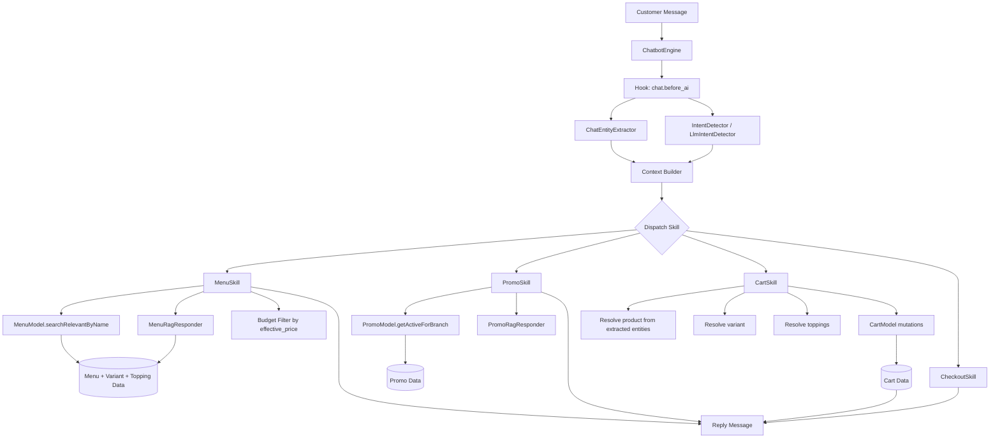

# Chatbot Flow And Entities

Dokumen ini menjelaskan alur end-to-end chat customer dan titik penerapan entity extraction, retrieval menu/promo, dan skill order.

## Ringkasan

- `ChatbotEngine` adalah entry point utama flow chat.
- `IntentDetector` atau `LlmIntentDetector` menentukan intent percakapan.
- `ChatEntityExtractor` mengekstrak entity terstruktur dari isi chat:
  - `product`
  - `qty`
  - `variant`
  - `price`
  - `currency`
  - `budget hint`
- `MenuSkill` menangani tanya menu, deskripsi, harga, dan budget query.
- `PromoSkill` menangani retrieval promo dan jawaban promo berbasis konteks.
- `CartSkill` menangani add, update, remove, topping, varian, dan cart summary.

## Diagram



## Detail Entity Extraction

`ChatEntityExtractor` bekerja sebelum dispatch skill, lalu hasilnya dimasukkan ke `context['entities']`.

Contoh struktur:

```php
[
  'products' => [
    [
      'name_candidate' => 'latte',
      'qty' => 2,
      'variant_label' => 'large',
      'mentioned_price' => 30000.0,
      'mentioned_currency' => 'IDR',
    ],
  ],
  'prices' => [
    ['amount' => 30000.0, 'currency' => 'IDR', 'raw' => 'Rp30.000'],
  ],
  'currencies' => [
    ['code' => 'IDR', 'source' => 'text'],
  ],
  'primary_currency' => 'IDR',
  'budget' => [
    'operator' => 'lte',
    'amount' => 30000.0,
    'currency' => 'IDR',
  ],
]
```

## Titik Penerapan

### 1. Menu Retrieval

- Query produk/deskripsi tetap memakai pencarian ter-ranking dari `MenuModel`.
- Jika LLM aktif, `MenuRagResponder` menyusun jawaban hanya dari context item yang diambil.
- Query seperti `kopi di bawah Rp30.000` diproses sebagai budget-aware menu lookup.

### 2. Promo Retrieval

- `PromoRagResponder` mengambil promo aktif lalu meranking promo yang paling relevan terhadap pesan user.
- Jika LLM aktif, jawaban promo dibuat dari promo context yang sudah diambil.

### 3. Cart Mutation

- `CartSkill` memakai entity `products` untuk resolve nama item dan varian.
- Jika user menyebut harga eksplisit dan currency cocok dengan cabang, hasil pencarian item dibias ke item yang punya harga sesuai.
- Jika varian belum disebut, state machine tetap meminta klarifikasi.

## Catatan Penting

- Retrieval menu/promo saat ini masih berbasis keyword scoring, belum vector embedding.
- `currency` utama tetap berasal dari konfigurasi cabang.
- Entity extraction membantu memahami teks chat user, tetapi tidak menggantikan sumber harga resmi dari menu cabang.
