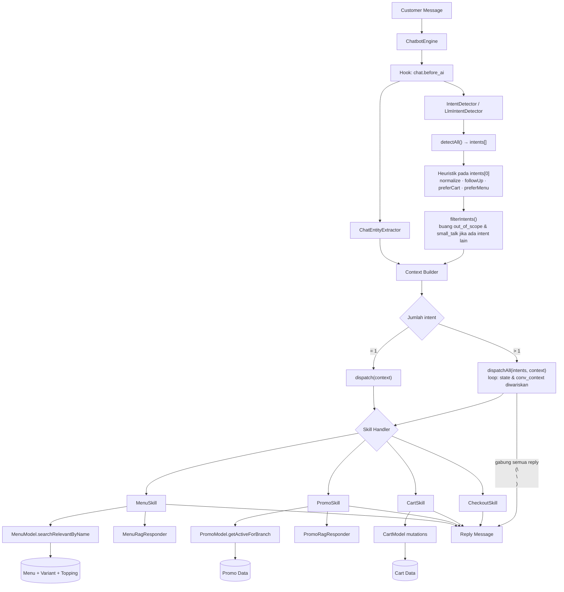

# Chatbot Flow And Entities

Dokumen ini menjelaskan alur end-to-end chat customer dan titik penerapan entity extraction, retrieval menu/promo, dan skill order.

## Ringkasan

- `ChatbotEngine` adalah entry point utama flow chat.
- `IntentDetector` atau `LlmIntentDetector` mendeteksi **semua** intent dalam satu pesan via `detectAll()`, diurutkan berdasarkan skor relevansi.
- `filterIntents()` membersihkan noise: `out_of_scope` dan `small_talk` dibuang jika ada intent actionable lain.
- `dispatchAll()` menjalankan setiap intent secara berurutan; state dan `conv_context` diwariskan antar dispatch, lalu semua reply digabung menjadi satu response.
- `ChatEntityExtractor` mengekstrak entity terstruktur dari isi chat:
  - `product`
  - `qty`
  - `variant`
  - `price`
  - `currency`
  - `budget hint`
- `MenuSkill` menangani tanya menu, deskripsi, harga, dan budget query.
- `PromoSkill` menangani retrieval promo dan jawaban promo berbasis konteks.
- `CartSkill` menangani add, update, remove, topping, varian, dan cart summary.

## Diagram


```mermaid
flowchart TD
    A[Customer Message] --> B[ChatbotEngine]
    B --> C[Hook: chat.before_ai]
    C --> D[ChatEntityExtractor]
    C --> E[IntentDetector / LlmIntentDetector]

    E --> E1["detectAll() → intents[]"]
    E1 --> E2["Heuristik pada intents[0]\nnormalize · followUp · preferCart · preferMenu"]
    E2 --> E3["filterIntents()\nbuang out_of_scope & small_talk jika ada intent lain"]

    D --> F[Context Builder]
    E3 --> F

    F --> G{Jumlah intent}
    G -->|= 1| H["dispatch(context)"]
    G -->|> 1| I["dispatchAll(intents, context)\nloop: state & conv_context diwariskan"]

    H --> Skill
    I --> Skill

    Skill{Skill Handler}
    Skill --> SMenu[MenuSkill]
    Skill --> SPromo[PromoSkill]
    Skill --> SCart[CartSkill]
    Skill --> SCheckout[CheckoutSkill]

    SMenu --> M1[MenuModel.searchRelevantByName]
    SMenu --> M2[MenuRagResponder]
    SPromo --> P1[PromoModel.getActiveForBranch]
    SPromo --> P2[PromoRagResponder]
    SCart --> C1[CartModel mutations]

    M1 --> DB[(Menu + Variant + Topping)]
    P1 --> DB2[(Promo Data)]
    C1 --> DB3[(Cart Data)]

    SMenu --> O[Reply Message]
    SPromo --> O
    SCart --> O
    SCheckout --> O
    I -->|"gabung semua reply\n(\\n\\n)"| O
```

## Multi-Intent Detection

Sejak versi terbaru, satu pesan customer dapat memicu dan memproses **lebih dari satu intent** sekaligus.

### Contoh

| Pesan Customer | Intent Terdeteksi | Hasil |
|---|---|---|
| `pesan 2 latte dan ada promo apa?` | `tambah_item`, `tanya_promo` | Latte masuk cart + info promo ditampilkan |
| `harga espresso berapa dan mau pesan 1` | `tanya_harga`, `tambah_item` | Harga dijawab + item masuk cart |
| `lihat cart dan checkout sekarang` | `lihat_cart`, `checkout` | Summary cart + flow checkout dimulai |

### Aturan Prioritas & Filter

1. Heuristik (`normalizePendingStateIntent`, `applyFollowUpHeuristics`, dll.) hanya diterapkan ke **intent pertama** (skor tertinggi).
2. `filterIntents()` membuang `out_of_scope` jika ada intent valid lain, dan membuang `small_talk` jika ada intent actionable.
3. Dalam **blocking states** (`awaiting_name`, `awaiting_variant`, `awaiting_confirmation`, dll.), `detectAll()` otomatis mengembalikan satu intent saja — perilaku lama tetap terjaga.
4. State hasil dispatch intent pertama **diwariskan** ke dispatch intent berikutnya.

### Komponen Kunci

| Komponen | File | Peran |
|---|---|---|
| `detectAll()` | `IntentDetectorInterface` | Kontrak multi-intent untuk semua detector |
| `scoreAllIntents()` | `IntentDetector` | Scoring semua keyword, return `string[]` |
| `filterIntents()` | `ChatbotEngine` | Bersihkan noise intent |
| `dispatchAll()` | `ChatbotEngine` | Loop dispatch + state propagation |

## Detail Entity Extraction

`ChatEntityExtractor` bekerja sebelum dispatch skill, lalu hasilnya dimasukkan ke `context['entities']`.

Contoh struktur:

```php
[
  'products' => [
    [
      'name_candidate' => 'latte',
      'qty' => 2,
      'variant_label' => 'large',
      'mentioned_price' => 30000.0,
      'mentioned_currency' => 'IDR',
    ],
  ],
  'prices' => [
    ['amount' => 30000.0, 'currency' => 'IDR', 'raw' => 'Rp30.000'],
  ],
  'currencies' => [
    ['code' => 'IDR', 'source' => 'text'],
  ],
  'primary_currency' => 'IDR',
  'budget' => [
    'operator' => 'lte',
    'amount' => 30000.0,
    'currency' => 'IDR',
  ],
]
```

## Titik Penerapan

### 1. Menu Retrieval

- Query produk/deskripsi tetap memakai pencarian ter-ranking dari `MenuModel`.
- Jika LLM aktif, `MenuRagResponder` menyusun jawaban hanya dari context item yang diambil.
- Query seperti `kopi di bawah Rp30.000` diproses sebagai budget-aware menu lookup.

### 2. Promo Retrieval

- `PromoRagResponder` mengambil promo aktif lalu meranking promo yang paling relevan terhadap pesan user.
- Jika LLM aktif, jawaban promo dibuat dari promo context yang sudah diambil.

### 3. Cart Mutation

- `CartSkill` memakai entity `products` untuk resolve nama item dan varian.
- Jika user menyebut harga eksplisit dan currency cocok dengan cabang, hasil pencarian item dibias ke item yang punya harga sesuai.
- Jika varian belum disebut, state machine tetap meminta klarifikasi.

## Konfigurasi Business Type

Setting `business_type` di tabel `branch_settings` mengontrol konteks bisnis yang dipakai pada semua prompt LLM.

| `branch_settings` key | Contoh nilai | Default |
|---|---|---|
| `business_type` | `coffee shop`, `apotek`, `mart`, `toko buah`, `bakery` | `toko` |

Cara set:
```sql
INSERT INTO branch_settings (branch_id, setting_key, setting_val)
VALUES (1, 'business_type', 'apotek')
ON DUPLICATE KEY UPDATE setting_val = 'apotek';
```

Atau melalui `BranchModel::setSetting($branchId, 'business_type', 'apotek')`.

Komponen yang terpengaruh oleh `business_type`:

| Komponen | Efek |
|---|---|
| `LlmIntentDetector` | Role prompt dan boundary `out_of_scope` berubah |
| `AnthropicIntentDetector` | System prompt di-cache per business type |
| `GeminiIntentDetector` | System prompt menyesuaikan vertical bisnis |
| `OpenRouterIntentDetector` | System prompt menyesuaikan vertical bisnis |
| `MenuRagResponder` | Dari "coffee shop menu assistant" → `{businessType} catalog assistant` |
| `PromoRagResponder` | Dari "coffee shop promo assistant" → `{businessType} promo assistant` |
| `FaqRagResponder` | Dari "coffee shop FAQ assistant" → `{businessType} FAQ assistant` |

## Catatan Penting

- Retrieval menu/promo saat ini masih berbasis keyword scoring, belum vector embedding.
- `currency` utama tetap berasal dari konfigurasi cabang.
- `business_type` default `'toko'` berlaku untuk cabang yang belum mengisi setting ini.
- Entity extraction membantu memahami teks chat user, tetapi tidak menggantikan sumber harga resmi dari menu cabang.
