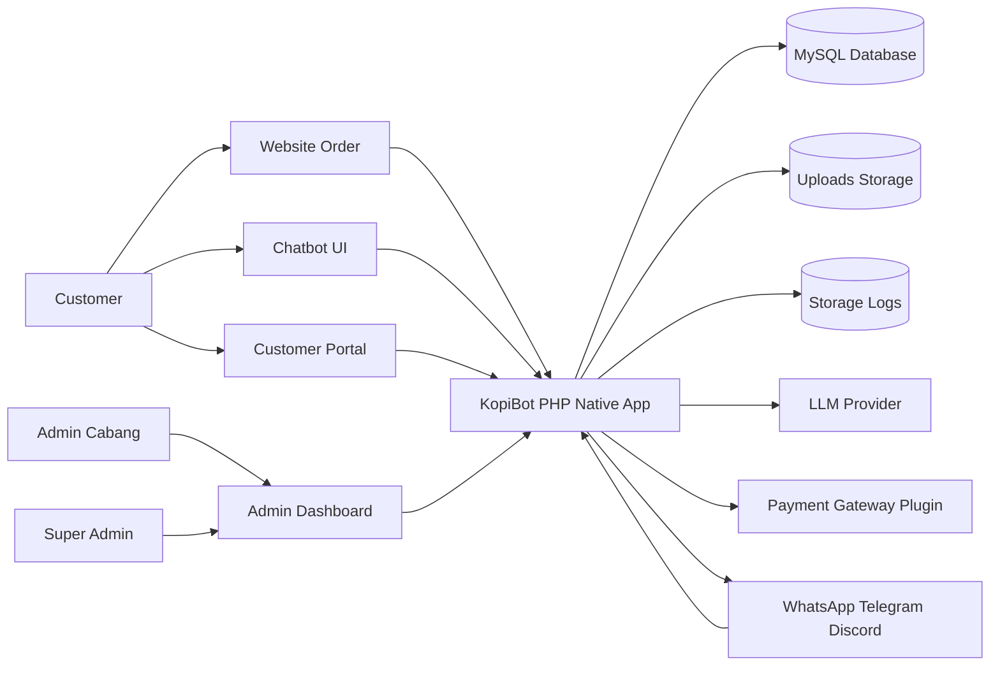
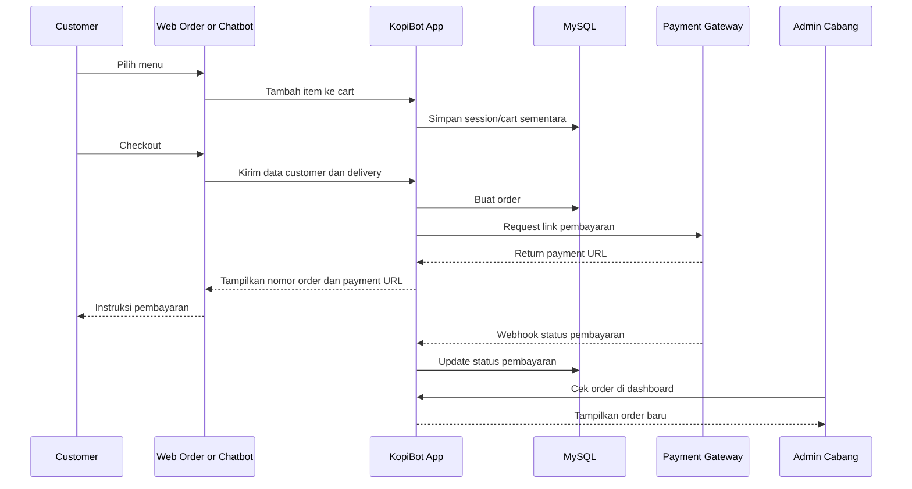
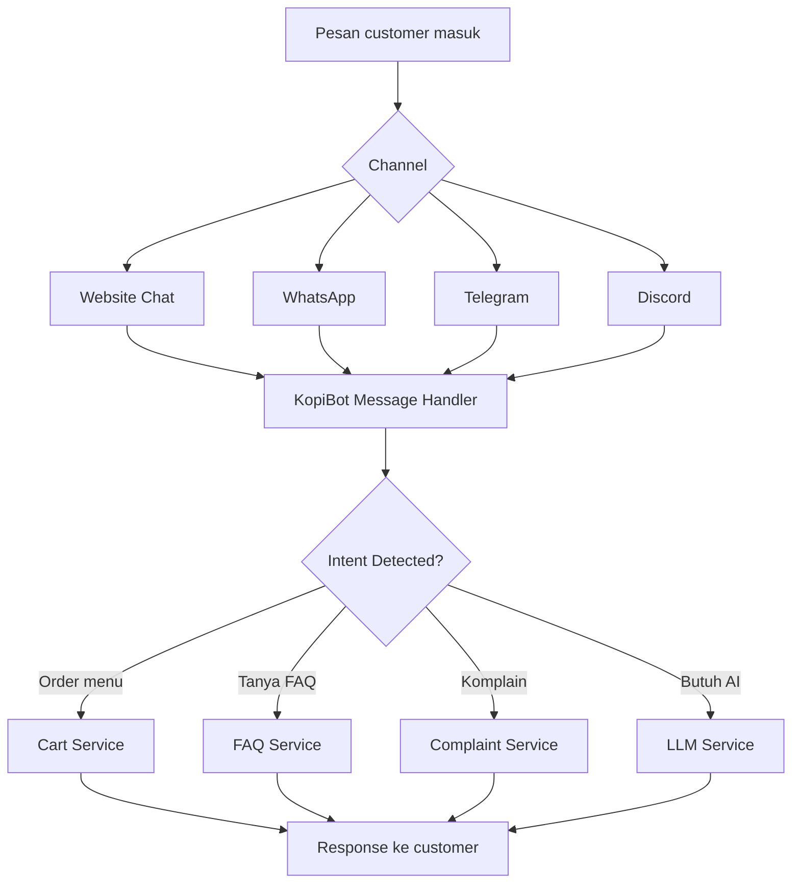
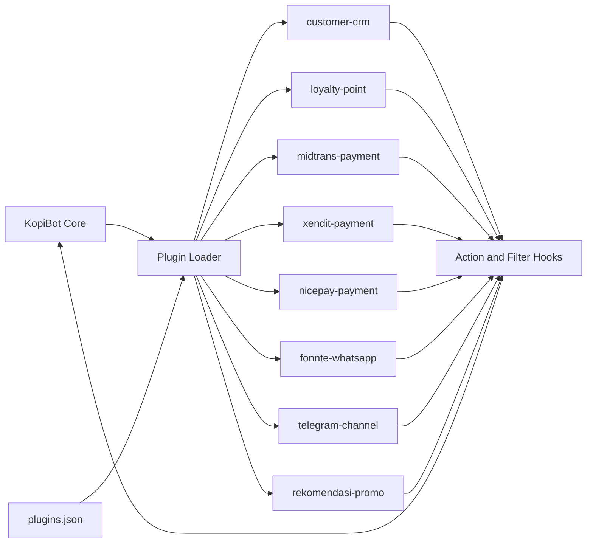
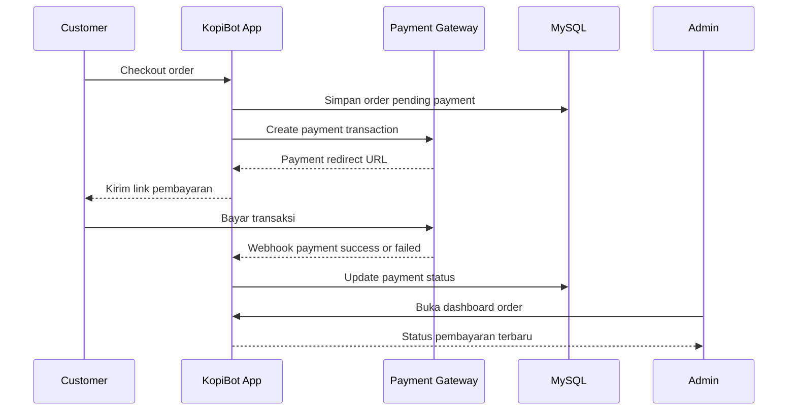

# API Dokumentasi dan Diagram Mermaid KopiBot

Dokumen ini melengkapi ebook `ebook-panduan-penggunaan-kopibot.md`. Isinya berfokus pada diagram Mermaid dan draft dokumentasi API untuk membantu developer memahami flow aplikasi, integrasi channel, integrasi payment gateway, dan plugin system.

---

## 1. Diagram Arsitektur Umum



---

## 2. Diagram Flow Order Customer



---

## 3. Diagram Flow Chatbot



---

## 4. Diagram Plugin System



---

## 5. Diagram Payment Gateway



---

# 6. Ringkasan API Endpoint

Dokumentasi ini memakai format draft. Nama endpoint dapat disesuaikan dengan implementasi final di folder `public/api`.

| Method | Endpoint | Fungsi |
|--------|----------|--------|
| GET | /api/branches | List cabang aktif |
| GET | /api/menu?branch={slug} | List menu per cabang |
| POST | /api/cart/add | Tambah item ke cart |
| POST | /api/cart/clear | Kosongkan cart |
| POST | /api/order/create | Buat order baru |
| GET | /api/order/status?order_no={order_no} | Cek status order |
| POST | /api/payment/webhook/{provider} | Callback payment gateway |
| POST | /api/whatsapp/webhook.php?branch={id} | Webhook WhatsApp |
| POST | /api/channel/webhook.php?channel=telegram | Webhook Telegram |
| POST | /api/channel/webhook.php?channel=discord | Webhook Discord |
| POST | /api/chat/message | Kirim pesan ke chatbot |
| GET | /api/customer/orders | Riwayat order customer |

---

## 7. API List Cabang

### Endpoint

```http
GET /api/branches
```

### Response

```json
{
  "success": true,
  "data": [
    {
      "id": 1,
      "name": "Jakarta Selatan",
      "slug": "jakarta-selatan",
      "address": "Jakarta Selatan",
      "is_active": true
    }
  ]
}
```

---

## 8. API List Menu per Cabang

### Endpoint

```http
GET /api/menu?branch=jakarta-selatan
```

### Response

```json
{
  "success": true,
  "branch": "jakarta-selatan",
  "data": [
    {
      "id": 101,
      "name": "Kopi Susu Aren",
      "category": "Coffee",
      "price": 25000,
      "description": "Kopi susu dengan gula aren",
      "is_active": true,
      "variants": [
        {"name": "Regular", "price_addon": 0},
        {"name": "Large", "price_addon": 5000}
      ],
      "toppings": [
        {"name": "Extra Shot", "price_addon": 7000}
      ]
    }
  ]
}
```

---

## 9. API Tambah Item ke Cart

### Endpoint

```http
POST /api/cart/add
```

### Request

```json
{
  "branch_slug": "jakarta-selatan",
  "product_id": 101,
  "qty": 2,
  "variant": "Regular",
  "toppings": ["Extra Shot"]
}
```

### Response

```json
{
  "success": true,
  "message": "Item berhasil ditambahkan ke cart",
  "cart": {
    "items": [
      {
        "product_id": 101,
        "name": "Kopi Susu Aren",
        "qty": 2,
        "price": 25000,
        "subtotal": 64000
      }
    ],
    "total": 64000
  }
}
```

---

## 10. API Buat Order

### Endpoint

```http
POST /api/order/create
```

### Request

```json
{
  "branch_slug": "jakarta-selatan",
  "customer": {
    "name": "Budi",
    "email": "budi@example.com",
    "whatsapp": "628123456789",
    "address": "Jl. Contoh No. 1"
  },
  "delivery_method": "delivery",
  "payment_method": "midtrans",
  "items": [
    {
      "product_id": 101,
      "qty": 2,
      "variant": "Regular",
      "toppings": ["Extra Shot"]
    }
  ]
}
```

### Response

```json
{
  "success": true,
  "message": "Order berhasil dibuat",
  "order": {
    "order_no": "ORD-20260527-0001",
    "status": "pending_payment",
    "payment_status": "unpaid",
    "total": 64000,
    "payment_url": "https://payment-gateway.example/pay/abc123"
  }
}
```

---

## 11. API Cek Status Order

### Endpoint

```http
GET /api/order/status?order_no=ORD-20260527-0001
```

### Response

```json
{
  "success": true,
  "order": {
    "order_no": "ORD-20260527-0001",
    "status": "processing",
    "payment_status": "paid",
    "delivery_status": "waiting_pickup",
    "total": 64000
  }
}
```

---

## 12. API Payment Webhook

### Endpoint

```http
POST /api/payment/webhook/{provider}
```

Contoh provider:

```text
midtrans
xendit
ipaymu
nicepay
```

### Request

```json
{
  "transaction_id": "TRX-123456",
  "order_no": "ORD-20260527-0001",
  "payment_status": "paid",
  "amount": 64000,
  "signature": "provider_signature"
}
```

### Response

```json
{
  "success": true,
  "message": "Webhook diterima"
}
```

---

## 13. API Chat Message

### Endpoint

```http
POST /api/chat/message
```

### Request

```json
{
  "branch_slug": "jakarta-selatan",
  "channel": "web",
  "customer_id": "guest-123",
  "message": "Saya mau pesan kopi susu aren 2"
}
```

### Response

```json
{
  "success": true,
  "reply": "Baik, saya tambahkan 2 Kopi Susu Aren ke cart. Mau tambah menu lain?",
  "intent": "add_to_cart",
  "cart_total": 50000
}
```

---

## 14. API Webhook WhatsApp

### Endpoint

```http
POST /api/whatsapp/webhook.php?branch=1
```

### Request

```json
{
  "from": "628123456789",
  "message": "Menu kopi apa saja?",
  "timestamp": "2026-05-27T10:00:00+07:00"
}
```

### Response

```json
{
  "success": true,
  "reply": "Kami punya Kopi Susu Aren, Americano, Cappuccino, Latte, dan menu lainnya."
}
```

---

## 15. Standar Response Error

Gunakan format error konsisten agar frontend dan integrasi lebih mudah membaca respons.

```json
{
  "success": false,
  "error_code": "VALIDATION_ERROR",
  "message": "Field branch_slug wajib diisi",
  "errors": {
    "branch_slug": "Branch slug tidak boleh kosong"
  }
}
```

Contoh error code:

| Error Code | Arti |
|------------|------|
| VALIDATION_ERROR | Payload tidak valid |
| NOT_FOUND | Data tidak ditemukan |
| UNAUTHORIZED | Belum login atau token salah |
| FORBIDDEN | Tidak punya akses |
| PAYMENT_FAILED | Payment gateway gagal |
| INTERNAL_ERROR | Error internal aplikasi |

---

## 16. Catatan Keamanan API

1. Jangan expose file `.env` ke public.
2. Gunakan HTTPS untuk production.
3. Validasi semua input dari customer.
4. Verifikasi signature webhook payment gateway.
5. Batasi akses endpoint admin menggunakan session atau token.
6. Simpan API key LLM dan payment gateway secara aman.
7. Catat log error tanpa membocorkan data sensitif.
8. Gunakan rate limit untuk endpoint chat dan webhook.

---

## 17. Rekomendasi Pengembangan Berikutnya

1. Tambahkan OpenAPI Specification.
2. Tambahkan Postman Collection.
3. Tambahkan API authentication berbasis token.
4. Tambahkan endpoint report order.
5. Tambahkan endpoint CRM customer.
6. Tambahkan endpoint loyalty point.
7. Tambahkan endpoint promo code validation.
8. Tambahkan retry queue untuk payment callback dan delivery callback.
