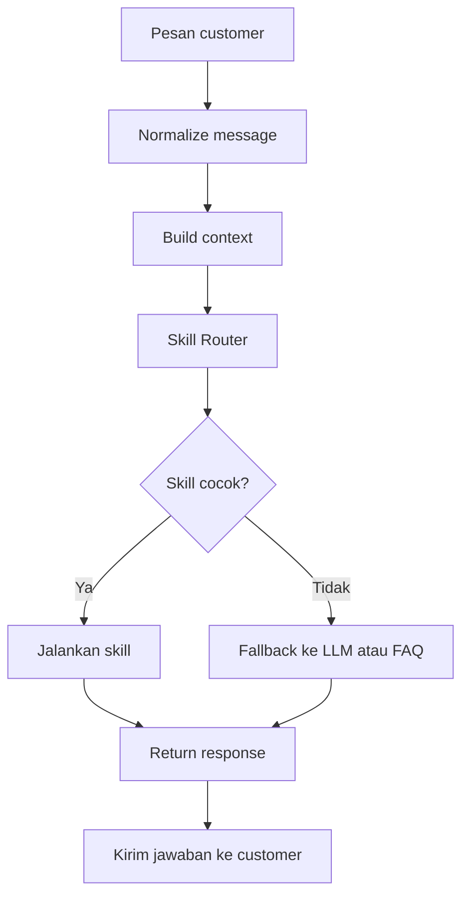
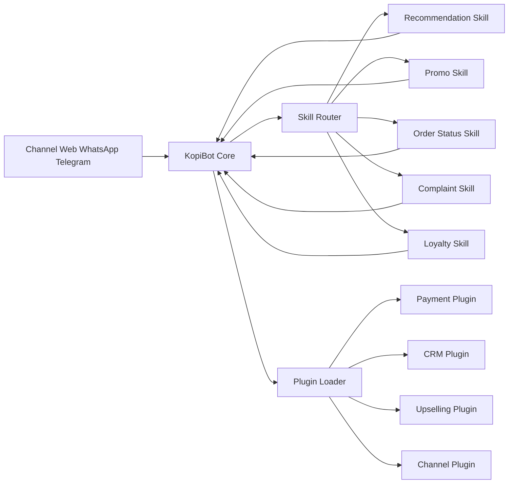

# Panduan Membuat Plugin dan Skills KopiBot

Dokumen ini menjelaskan cara membuat plugin baru dan skills untuk KopiBot. Plugin dipakai untuk menambah fitur aplikasi tanpa mengubah core terlalu banyak. Skills dipakai sebagai kemampuan khusus chatbot atau AI agent, misalnya skill rekomendasi menu, skill cek promo, skill komplain, skill loyalty, dan skill order ulang.

---

## 1. Konsep Plugin

Plugin adalah modul tambahan yang ditempatkan di folder `plugins/`. Setiap plugin idealnya memiliki file bootstrap, class utama, konfigurasi, dokumentasi singkat, dan optional schema database.

Struktur dasar plugin:

```text
plugins/nama-plugin/
|-- plugin.php
|-- NamaPlugin.php
|-- README.md
|-- config.php
`-- schema.sql
```

Contoh nama plugin:

```text
plugins/rekomendasi-menu/
plugins/loyalty-point/
plugins/customer-crm/
plugins/fonnte-whatsapp/
plugins/midtrans-payment/
```

---

## 2. Membuat Folder Plugin Baru

Misalnya kita ingin membuat plugin `rekomendasi-menu`.

Buat folder:

```text
plugins/rekomendasi-menu/
```

Isi minimal:

```text
plugins/rekomendasi-menu/
|-- plugin.php
`-- RekomendasiMenuPlugin.php
```

---

## 3. File plugin.php

File `plugin.php` berfungsi sebagai entry point. File ini dipanggil oleh plugin loader saat aplikasi membaca daftar plugin aktif.

Contoh sederhana:

```php
<?php

require_once __DIR__ . '/RekomendasiMenuPlugin.php';

return new RekomendasiMenuPlugin();
```

---

## 4. Class Utama Plugin

Contoh class plugin:

```php
<?php

class RekomendasiMenuPlugin
{
    public function register($hooks)
    {
        $hooks->addFilter('chat.before_ai', [$this, 'prepareRecommendationContext']);
        $hooks->addAction('order.created', [$this, 'logRecommendationResult']);
    }

    public function prepareRecommendationContext($payload)
    {
        if (!isset($payload['message'])) {
            return $payload;
        }

        $message = strtolower($payload['message']);

        if (str_contains($message, 'rekomendasi') || str_contains($message, 'menu favorit')) {
            $payload['system_context'][] = 'Customer sedang meminta rekomendasi menu. Gunakan data menu aktif dan promo yang tersedia.';
        }

        return $payload;
    }

    public function logRecommendationResult($order)
    {
        error_log('[rekomendasi-menu] Order created: ' . json_encode($order));
    }
}
```

---

## 5. Mendaftarkan Plugin di plugins.json

Aktifkan plugin melalui file:

```text
plugins/plugins.json
```

Contoh:

```json
{
  "active_plugins": [
    "customer-crm",
    "loyalty-point",
    "rekomendasi-menu"
  ]
}
```

Setelah plugin aktif, aplikasi akan membaca folder plugin dan menjalankan `plugin.php`.

---

## 6. Hook Plugin yang Umum Dipakai

| Hook | Type | Fungsi |
|------|------|--------|
| order.created | action | Dipanggil saat order baru berhasil dibuat |
| order.status_changed | action | Dipanggil saat status order berubah |
| order.payment_updated | action | Dipanggil saat status pembayaran berubah |
| cart.total | filter | Mengubah total cart, misalnya diskon |
| cart.before_checkout | filter | Validasi sebelum checkout |
| chat.message_received | action | Dipanggil saat pesan masuk dari channel |
| chat.before_ai | filter | Menambah konteks sebelum pesan dikirim ke LLM |
| chat.after_ai | filter | Memproses jawaban LLM sebelum dikirim ke customer |
| llm.providers | filter | Menambahkan provider LLM baru |
| channel.registered | filter | Menambahkan channel baru |
| dashboard.nav_items | filter | Menambahkan menu di dashboard |

---

## 7. Contoh Plugin Diskon Cart

Contoh plugin untuk memberi diskon 10 persen jika total cart lebih dari 100000.

```php
<?php

class DiskonCartPlugin
{
    public function register($hooks)
    {
        $hooks->addFilter('cart.total', [$this, 'applyDiscount']);
    }

    public function applyDiscount($cart)
    {
        if (!isset($cart['total'])) {
            return $cart;
        }

        if ($cart['total'] >= 100000) {
            $cart['discount'] = $cart['total'] * 0.10;
            $cart['grand_total'] = $cart['total'] - $cart['discount'];
            $cart['discount_note'] = 'Diskon 10 persen untuk order minimal 100000';
        }

        return $cart;
    }
}
```

---

## 8. Konsep Skills

Skills adalah kemampuan khusus chatbot atau AI agent. Skill tidak selalu harus menjadi plugin terpisah, tetapi idealnya skill dibuat modular agar mudah diuji dan dikembangkan.

Contoh skills:

1. Skill rekomendasi menu.
2. Skill cek promo.
3. Skill cek status order.
4. Skill repeat order.
5. Skill komplain customer.
6. Skill cek loyalty point.
7. Skill upselling.
8. Skill FAQ.
9. Skill payment assistance.
10. Skill delivery tracking.

Struktur folder skills yang disarankan:

```text
app/Skills/
|-- SkillInterface.php
|-- RecommendationSkill.php
|-- PromoSkill.php
|-- OrderStatusSkill.php
|-- ComplaintSkill.php
`-- LoyaltySkill.php
```

---

## 9. Skill Interface

Buat interface standar agar semua skill memiliki pola yang sama.

```php
<?php

interface SkillInterface
{
    public function canHandle(array $context): bool;

    public function handle(array $context): array;
}
```

`canHandle()` menentukan apakah skill cocok untuk pesan customer. `handle()` menjalankan logic skill dan mengembalikan response.

---

## 10. Contoh Skill Rekomendasi Menu

```php
<?php

class RecommendationSkill implements SkillInterface
{
    public function canHandle(array $context): bool
    {
        $message = strtolower($context['message'] ?? '');

        return str_contains($message, 'rekomendasi')
            || str_contains($message, 'menu favorit')
            || str_contains($message, 'yang enak apa');
    }

    public function handle(array $context): array
    {
        return [
            'success' => true,
            'intent' => 'recommendation',
            'reply' => 'Rekomendasi hari ini: Kopi Susu Aren, Cappuccino, dan Croissant. Jika ingin rasa creamy, pilih Kopi Susu Aren. Jika ingin kopi lebih strong, pilih Americano atau Extra Shot.',
            'suggested_products' => [
                'Kopi Susu Aren',
                'Cappuccino',
                'Croissant'
            ]
        ];
    }
}
```

---

## 11. Contoh Skill Cek Status Order

```php
<?php

class OrderStatusSkill implements SkillInterface
{
    public function canHandle(array $context): bool
    {
        $message = strtolower($context['message'] ?? '');

        return str_contains($message, 'status order')
            || str_contains($message, 'pesanan saya')
            || str_contains($message, 'order saya');
    }

    public function handle(array $context): array
    {
        $orderNo = $context['order_no'] ?? null;

        if (!$orderNo) {
            return [
                'success' => false,
                'intent' => 'order_status',
                'reply' => 'Mohon kirim nomor order agar saya bisa cek status pesanan Anda.'
            ];
        }

        return [
            'success' => true,
            'intent' => 'order_status',
            'reply' => 'Order ' . $orderNo . ' sedang diproses. Kami akan update jika status berubah.',
            'order_no' => $orderNo,
            'status' => 'processing'
        ];
    }
}
```

---

## 12. Skill Router

Skill Router bertugas memilih skill yang paling cocok berdasarkan pesan customer.

```php
<?php

class SkillRouter
{
    private array $skills = [];

    public function registerSkill(SkillInterface $skill): void
    {
        $this->skills[] = $skill;
    }

    public function handle(array $context): array
    {
        foreach ($this->skills as $skill) {
            if ($skill->canHandle($context)) {
                return $skill->handle($context);
            }
        }

        return [
            'success' => false,
            'intent' => 'fallback',
            'reply' => 'Maaf, saya belum memahami pertanyaan Anda. Apakah ingin melihat menu, membuat order, cek promo, atau cek status order?'
        ];
    }
}
```

---

## 13. Diagram Flow Skills



---

## 14. Diagram Relasi Plugin dan Skills



---

## 15. Best Practice Membuat Plugin dan Skills

1. Satu plugin fokus pada satu domain fitur.
2. Jangan menaruh semua logic di satu file besar.
3. Gunakan hook agar tidak mengubah core terlalu banyak.
4. Buat README.md di setiap plugin.
5. Buat schema.sql jika plugin butuh tabel tambahan.
6. Buat config.php jika plugin butuh konfigurasi khusus.
7. Validasi semua input dari customer.
8. Jangan menyimpan API key langsung di source code.
9. Tulis log error secukupnya, jangan bocorkan data sensitif.
10. Uji plugin di local atau staging sebelum production.
11. Buat skill dengan `canHandle()` yang jelas.
12. Pastikan fallback tetap tersedia jika skill tidak cocok.

---

## 16. Checklist Membuat Plugin Baru

| Checklist | Status |
|-----------|--------|
| Folder plugin dibuat | Belum/Sudah |
| plugin.php dibuat | Belum/Sudah |
| Class utama plugin dibuat | Belum/Sudah |
| Hook register dibuat | Belum/Sudah |
| README plugin dibuat | Belum/Sudah |
| Config dibuat bila diperlukan | Belum/Sudah |
| Schema dibuat bila diperlukan | Belum/Sudah |
| Plugin didaftarkan di plugins.json | Belum/Sudah |
| Diuji di local | Belum/Sudah |
| Diuji di staging | Belum/Sudah |
| Aman untuk production | Belum/Sudah |

---

## 17. Checklist Membuat Skill Baru

| Checklist | Status |
|-----------|--------|
| Nama skill ditentukan | Belum/Sudah |
| Intent skill ditentukan | Belum/Sudah |
| Keyword awal ditentukan | Belum/Sudah |
| canHandle dibuat | Belum/Sudah |
| handle dibuat | Belum/Sudah |
| Response JSON distandarkan | Belum/Sudah |
| Skill didaftarkan ke SkillRouter | Belum/Sudah |
| Fallback diuji | Belum/Sudah |
| Test beberapa variasi pesan customer | Belum/Sudah |

---

## 18. Rekomendasi Skills untuk KopiBot

Skills prioritas yang sebaiknya dibuat:

1. RecommendationSkill untuk rekomendasi menu.
2. PromoSkill untuk cek promo aktif.
3. CartSkill untuk tambah, hapus, dan cek cart.
4. CheckoutSkill untuk memandu checkout.
5. OrderStatusSkill untuk cek status pesanan.
6. ComplaintSkill untuk mencatat keluhan.
7. LoyaltySkill untuk cek dan redeem point.
8. PaymentSkill untuk membantu pembayaran.
9. DeliverySkill untuk cek status pengiriman.
10. FAQSkill untuk menjawab pertanyaan umum.

Dengan pola plugin dan skills ini, KopiBot dapat berkembang menjadi AI commerce agent yang modular, mudah dirawat, dan mudah dikembangkan untuk banyak jenis bisnis.
