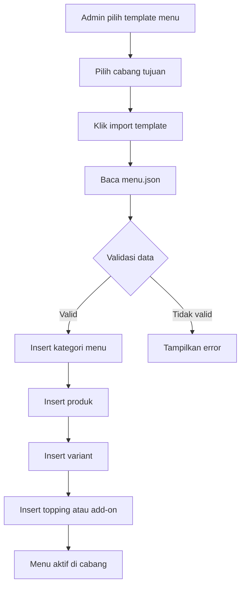

# Panduan Plugin Template Menu KopiBot

Dokumen ini menjelaskan konsep plugin template menu untuk berbagai jenis usaha. Template menu membantu owner bisnis mengisi data produk awal dengan cepat, sehingga aplikasi dapat langsung dicoba tanpa input menu satu per satu.

Template menu sangat berguna untuk demo, onboarding cabang baru, dan vertical business seperti bakery, fresh meat market, serta masakan tradisional Indonesia.

---

## 1. Konsep Plugin Template Menu

Plugin template menu adalah plugin yang berisi data menu siap pakai. Data tersebut dapat diimport ke database sebagai menu awal untuk cabang tertentu.

Contoh plugin template menu:

```text
plugins/bakery-template/
plugins/meat-veggie-template/
plugins/indonesian-food-template/
```

Setiap template sebaiknya memiliki:

```text
plugins/nama-template/
|-- plugin.php
|-- seed.sql
|-- menu.json
|-- README.md
`-- images/
```

Penjelasan:

| File/Folder | Fungsi |
|-------------|--------|
| plugin.php | Entry point plugin |
| seed.sql | Data SQL untuk insert menu awal |
| menu.json | Data menu dalam format JSON |
| README.md | Dokumentasi template |
| images | Foto produk contoh bila tersedia |

---

## 2. Tujuan Template Menu

Template menu dibuat agar KopiBot dapat digunakan lebih cepat oleh berbagai jenis bisnis.

Manfaat utama:

1. Mempercepat setup awal.
2. Memudahkan demo ke calon client.
3. Membantu owner bisnis yang belum punya struktur menu digital.
4. Menjadi baseline data untuk chatbot.
5. Mempermudah testing flow order, promo, loyalty, dan payment.
6. Memudahkan pembuatan banyak cabang dengan menu awal seragam.

---

## 3. Template Menu Bakery

Template bakery cocok untuk toko roti, pastry shop, cake shop, dessert cafe, dan bakery rumahan.

Kategori menu yang disarankan:

1. Bread.
2. Pastry.
3. Cake Slice.
4. Whole Cake.
5. Cookies.
6. Donut.
7. Dessert Box.
8. Beverage.
9. Hampers.
10. Seasonal Menu.

Contoh item bakery:

| Kategori | Nama Menu | Harga Contoh |
|----------|-----------|--------------|
| Bread | Roti Sobek Coklat | 18000 |
| Bread | Roti Tawar Premium | 28000 |
| Pastry | Butter Croissant | 25000 |
| Pastry | Almond Croissant | 32000 |
| Cake Slice | Red Velvet Slice | 35000 |
| Cake Slice | Chocolate Fudge Slice | 38000 |
| Whole Cake | Birthday Cake 18 cm | 250000 |
| Cookies | Choco Chip Cookies | 45000 |
| Donut | Donut Glaze | 12000 |
| Dessert Box | Tiramisu Dessert Box | 55000 |

Variant yang cocok:

| Variant | Contoh |
|---------|--------|
| Size | Small, Regular, Large |
| Packaging | Box biasa, Gift box, Hampers box |
| Sweetness | Normal, Less sugar |
| Candle | Tanpa lilin, Tambah lilin |

Topping atau add-on:

| Add-on | Harga Contoh |
|--------|--------------|
| Birthday candle | 5000 |
| Greeting card | 10000 |
| Extra cream | 8000 |
| Premium box | 15000 |

Contoh `menu.json` untuk bakery:

```json
[
  {
    "category": "Pastry",
    "name": "Butter Croissant",
    "description": "Croissant klasik dengan aroma butter premium",
    "price": 25000,
    "variants": ["Regular", "Large"],
    "addons": ["Greeting Card", "Premium Box"]
  },
  {
    "category": "Cake Slice",
    "name": "Red Velvet Slice",
    "description": "Potongan red velvet lembut dengan cream cheese",
    "price": 35000,
    "variants": ["Slice", "Double Slice"],
    "addons": ["Birthday Candle", "Greeting Card"]
  }
]
```

---

## 4. Template Menu Fresh Meat Market

Template fresh meat cocok untuk toko daging, frozen food, butcher shop, supplier daging, toko ayam, toko seafood, dan fresh market.

Kategori menu yang disarankan:

1. Beef.
2. Chicken.
3. Lamb.
4. Seafood.
5. Frozen Food.
6. Sausage and Processed Meat.
7. Ready to Cook.
8. BBQ Package.
9. Soup Package.
10. Seasoning and Sauce.

Contoh item fresh meat:

| Kategori | Nama Menu | Harga Contoh |
|----------|-----------|--------------|
| Beef | Daging Sapi Has Dalam 500 gr | 85000 |
| Beef | Daging Sapi Slice 500 gr | 78000 |
| Beef | Iga Sapi 1 kg | 125000 |
| Chicken | Ayam Broiler Utuh 1 ekor | 45000 |
| Chicken | Dada Ayam Fillet 500 gr | 42000 |
| Seafood | Salmon Fillet 250 gr | 95000 |
| Seafood | Udang Kupas 500 gr | 68000 |
| Frozen Food | Nugget Ayam 500 gr | 38000 |
| BBQ Package | Paket BBQ Family | 250000 |
| Ready to Cook | Beef Teriyaki Ready to Cook | 65000 |

Variant yang cocok:

| Variant | Contoh |
|---------|--------|
| Weight | 250 gr, 500 gr, 1 kg |
| Cut Type | Slice, Cube, Minced, Whole |
| Condition | Fresh, Frozen |
| Packaging | Vacuum pack, Regular pack |

Add-on yang cocok:

| Add-on | Harga Contoh |
|--------|--------------|
| Vacuum pack | 5000 |
| Ice gel | 7000 |
| BBQ sauce | 15000 |
| Sambal sauce | 12000 |

Contoh `menu.json` untuk fresh meat:

```json
[
  {
    "category": "Beef",
    "name": "Daging Sapi Slice 500 gr",
    "description": "Daging sapi slice cocok untuk yakiniku, teriyaki, dan hotpot",
    "price": 78000,
    "variants": ["Fresh", "Frozen"],
    "addons": ["Vacuum Pack", "Ice Gel"]
  },
  {
    "category": "BBQ Package",
    "name": "Paket BBQ Family",
    "description": "Paket daging dan sosis untuk BBQ keluarga",
    "price": 250000,
    "variants": ["Regular", "Large"],
    "addons": ["BBQ Sauce", "Ice Gel"]
  }
]
```

---

## 5. Template Menu Masakan Tradisional Indonesia

Template masakan tradisional Indonesia cocok untuk warung makan, restoran Indonesia, catering rumahan, nasi box, dapur online, dan cloud kitchen.

Kategori menu yang disarankan:

1. Nasi dan Paket Komplit.
2. Ayam.
3. Bebek.
4. Ikan.
5. Sapi dan Kambing.
6. Sayur dan Tumisan.
7. Sambal.
8. Gorengan.
9. Minuman Tradisional.
10. Paket Catering.

Contoh item masakan Indonesia:

| Kategori | Nama Menu | Harga Contoh |
|----------|-----------|--------------|
| Nasi Paket | Nasi Ayam Bakar Komplit | 35000 |
| Nasi Paket | Nasi Rendang Komplit | 42000 |
| Ayam | Ayam Goreng Lengkuas | 28000 |
| Ayam | Ayam Bakar Madu | 30000 |
| Bebek | Bebek Goreng Sambal Ijo | 45000 |
| Ikan | Ikan Gurame Bakar | 85000 |
| Sapi | Rendang Daging | 38000 |
| Sayur | Sayur Asem | 18000 |
| Sambal | Sambal Terasi | 7000 |
| Minuman | Es Cendol | 18000 |

Variant yang cocok:

| Variant | Contoh |
|---------|--------|
| Level Pedas | Tidak pedas, Sedang, Pedas, Sangat pedas |
| Nasi | Tanpa nasi, Nasi putih, Nasi uduk, Nasi merah |
| Porsi | Regular, Jumbo |
| Sambal | Sambal terasi, Sambal ijo, Sambal matah |

Add-on yang cocok:

| Add-on | Harga Contoh |
|--------|--------------|
| Tambah nasi | 7000 |
| Tambah sambal | 5000 |
| Telur dadar | 8000 |
| Tahu tempe | 7000 |
| Lalapan ekstra | 5000 |

Contoh `menu.json` untuk masakan tradisional Indonesia:

```json
[
  {
    "category": "Nasi Paket",
    "name": "Nasi Ayam Bakar Komplit",
    "description": "Nasi, ayam bakar, sambal, lalapan, tahu, dan tempe",
    "price": 35000,
    "variants": ["Regular", "Jumbo"],
    "addons": ["Tambah Sambal", "Telur Dadar", "Tahu Tempe"]
  },
  {
    "category": "Sapi",
    "name": "Rendang Daging",
    "description": "Rendang daging sapi bumbu tradisional Indonesia",
    "price": 38000,
    "variants": ["Tanpa Nasi", "Dengan Nasi"],
    "addons": ["Tambah Nasi", "Tambah Sambal"]
  }
]
```

---

## 6. Contoh plugin.php Template Menu

Contoh entry point plugin template:

```php
<?php

require_once __DIR__ . '/TemplateMenuPlugin.php';

return new TemplateMenuPlugin([
    'name' => 'indonesian-food-template',
    'label' => 'Template Menu Masakan Tradisional Indonesia',
    'menu_file' => __DIR__ . '/menu.json'
]);
```

---

## 7. Contoh Class TemplateMenuPlugin

```php
<?php

class TemplateMenuPlugin
{
    private array $config;

    public function __construct(array $config)
    {
        $this->config = $config;
    }

    public function register($hooks)
    {
        $hooks->addAction('dashboard.nav_items', [$this, 'addDashboardMenu']);
        $hooks->addAction('template_menu.import', [$this, 'importMenu']);
    }

    public function addDashboardMenu($items)
    {
        $items[] = [
            'label' => $this->config['label'],
            'url' => '/dashboard/template-menu.php?template=' . $this->config['name']
        ];

        return $items;
    }

    public function importMenu($payload)
    {
        $branchId = $payload['branch_id'] ?? null;

        if (!$branchId) {
            return [
                'success' => false,
                'message' => 'branch_id wajib diisi'
            ];
        }

        $json = file_get_contents($this->config['menu_file']);
        $menus = json_decode($json, true);

        if (!is_array($menus)) {
            return [
                'success' => false,
                'message' => 'Format menu.json tidak valid'
            ];
        }

        return [
            'success' => true,
            'message' => 'Template menu siap diimport',
            'branch_id' => $branchId,
            'total_menu' => count($menus),
            'menus' => $menus
        ];
    }
}
```

---

## 8. Diagram Flow Import Template Menu



---

## 9. API Import Template Menu

Endpoint draft:

```http
POST /api/template-menu/import
```

Request:

```json
{
  "branch_id": 1,
  "template": "indonesian-food-template",
  "overwrite_existing": false
}
```

Response sukses:

```json
{
  "success": true,
  "message": "Template menu berhasil diimport",
  "branch_id": 1,
  "template": "indonesian-food-template",
  "total_category": 10,
  "total_product": 80
}
```

Response gagal:

```json
{
  "success": false,
  "error_code": "TEMPLATE_NOT_FOUND",
  "message": "Template menu tidak ditemukan"
}
```

---

## 10. Rekomendasi Jumlah Menu per Template

| Template | Jumlah Awal Ideal | Keterangan |
|----------|-------------------|------------|
| Bakery | 50 sampai 100 item | Roti, pastry, cake, dessert, minuman |
| Fresh Meat | 50 sampai 100 item | Daging, ayam, seafood, frozen, paket BBQ |
| Masakan Tradisional Indonesia | 80 sampai 150 item | Nasi paket, lauk, sayur, sambal, minuman, catering |

Jumlah menu tidak perlu terlalu banyak di awal. Yang penting kategori jelas, harga masuk akal, dan mudah dipahami chatbot.

---

## 11. Best Practice Template Menu

1. Gunakan nama menu yang jelas dan mudah dicari.
2. Hindari nama menu yang terlalu mirip.
3. Pisahkan kategori utama dengan rapi.
4. Gunakan variant untuk ukuran, porsi, level pedas, atau berat.
5. Gunakan add-on untuk topping, sambal, packaging, dan tambahan khusus.
6. Pastikan harga memakai angka integer tanpa simbol mata uang.
7. Buat deskripsi pendek agar chatbot mudah menjelaskan menu.
8. Pastikan setiap item memiliki status aktif.
9. Siapkan foto produk bila memungkinkan.
10. Uji order dari chatbot setelah template diimport.

---

## 12. Skill yang Cocok untuk Template Menu

Template menu akan lebih kuat jika digabungkan dengan skills chatbot.

| Template | Skill yang Disarankan |
|----------|------------------------|
| Bakery | Cake recommendation, birthday order, hampers suggestion |
| Fresh Meat | Cut recommendation, cooking suggestion, BBQ package recommendation |
| Masakan Indonesia | Spicy level helper, paket nasi recommendation, catering suggestion |

Contoh respons skill untuk bakery:

```text
Untuk ulang tahun, kami rekomendasikan Birthday Cake 18 cm dengan greeting card dan lilin. Jika ingin yang lebih praktis, bisa pilih dessert box atau hampers box.
```

Contoh respons skill untuk fresh meat:

```text
Untuk BBQ keluarga, kami rekomendasikan Paket BBQ Family. Paket ini bisa ditambah BBQ sauce, ice gel, dan vacuum pack agar daging tetap aman selama pengiriman.
```

Contoh respons skill untuk masakan Indonesia:

```text
Jika ingin menu paling aman untuk makan siang, pilih Nasi Ayam Bakar Komplit level pedas sedang. Jika ingin lauk khas Indonesia, Rendang Daging cocok dipilih dengan tambahan nasi dan sambal.
```

---

## 13. Checklist Membuat Template Menu Baru

| Checklist | Status |
|-----------|--------|
| Nama template ditentukan | Belum/Sudah |
| Kategori menu dibuat | Belum/Sudah |
| Data produk dibuat | Belum/Sudah |
| Variant dibuat | Belum/Sudah |
| Add-on dibuat | Belum/Sudah |
| menu.json dibuat | Belum/Sudah |
| seed.sql dibuat bila diperlukan | Belum/Sudah |
| plugin.php dibuat | Belum/Sudah |
| README.md dibuat | Belum/Sudah |
| Test import ke cabang lokal | Belum/Sudah |
| Test order dari web | Belum/Sudah |
| Test order dari chatbot | Belum/Sudah |

---

## 14. Penutup

Plugin template menu membuat KopiBot lebih mudah dijual, didemokan, dan digunakan oleh berbagai jenis bisnis. Dengan template bakery, fresh meat market, dan masakan tradisional Indonesia, KopiBot tidak hanya cocok untuk coffee shop, tetapi juga dapat diperluas menjadi AI commerce platform untuk banyak kategori usaha F&B.
